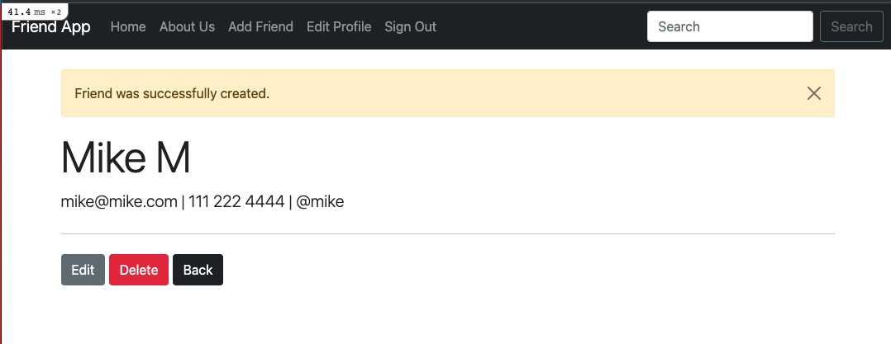
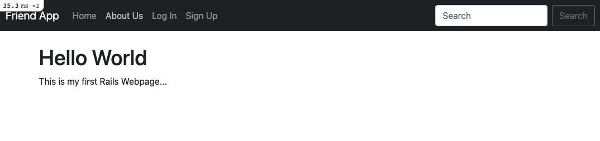
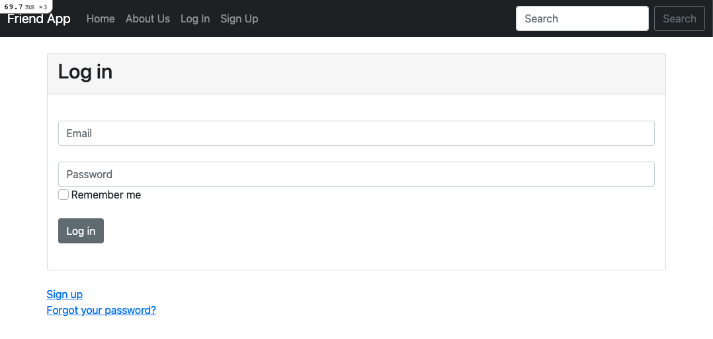
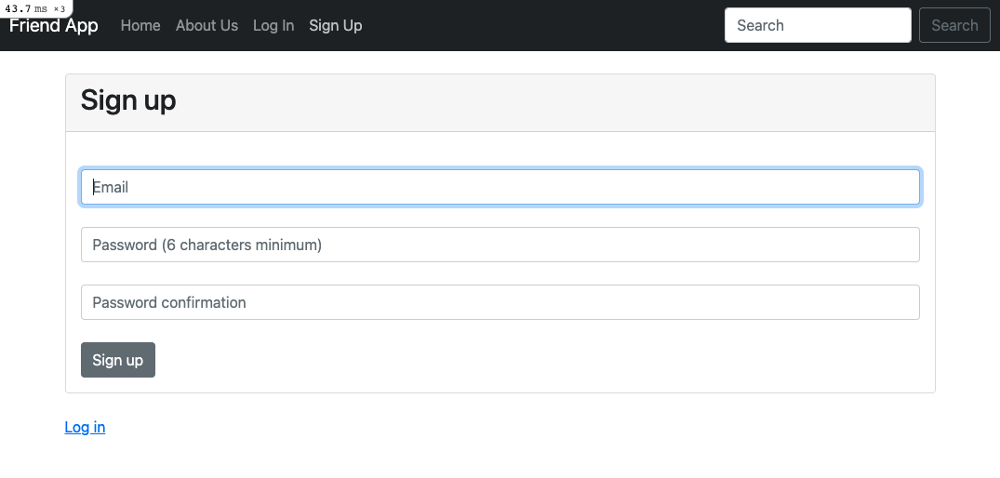
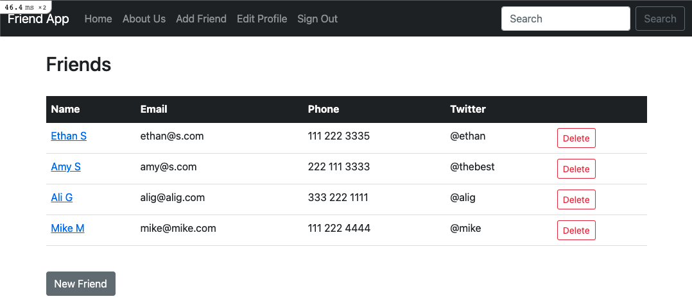
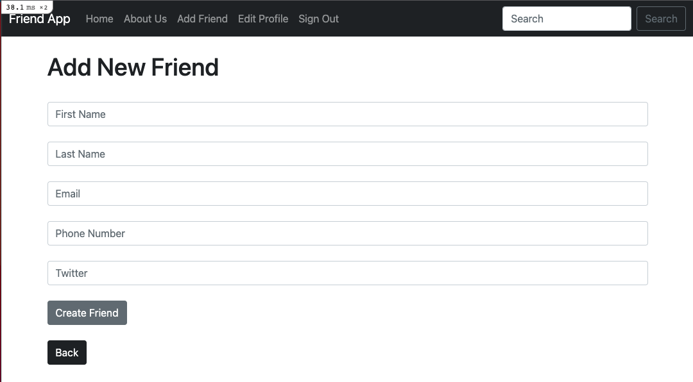
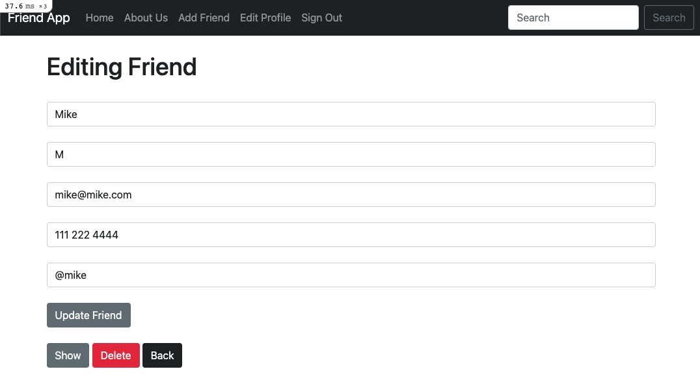

# Friend App

## Overview

This is my first project with Ruby on Rails. With this app you are able to create a profile and add friends information in a structured list. You are able to add, edit, and delete any friends you want. Have fun!

## Technologies Used

- Ruby on Rails
- HTML
- Bootstrap

## Home Page

If you are signed in you will see your list of friends:

If you are not signed in you will see:

## Login Page

You can login to your own account here:

## Sign Up Page

If you do not have an account you can create one here:

## Friends List

This is the list of your friends that you create:

## Create Friend

You can create a friend here:

## Edit Friend

You can edit or delete your friend here:

## Deployed Application

Deployed application [here](https://rubyrailsfriend.herokuapp.com/)

# friendapp
